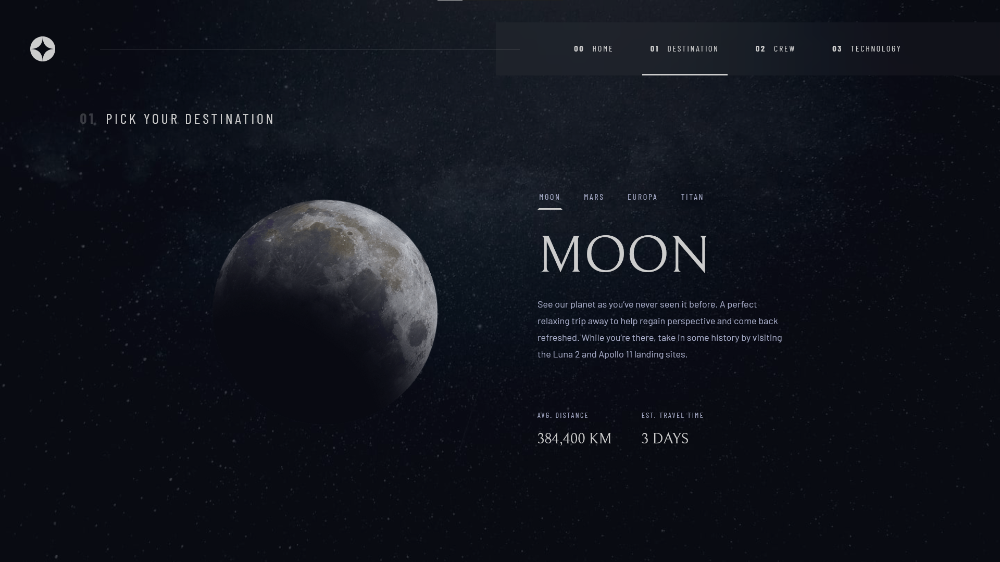
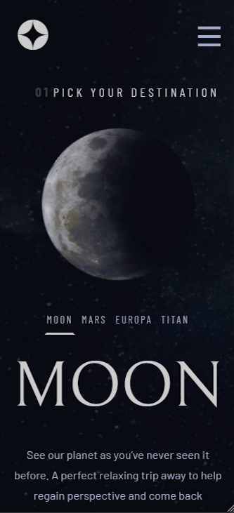

# nk_space_website

## Installation

- cd nk_space_website
  - npm i
  - npm i axios
  - npm i react-router-dom
  
- cd back
  - npm i express 

## Project goal

  - Improve my front-end skills
  - Learn how to use axios in order to get data from a json file.
  - Getting to know the specific characteristics of react (useSate, useEffect...)

## Languages and tools used

  - React Js
  - Vite
  - Express
  - Figma

## Render

## Credits

  This exercise is available on the frontend mentor website, with the figma file
  provided. You can go and check if you want to try it (no partnership with this website).
